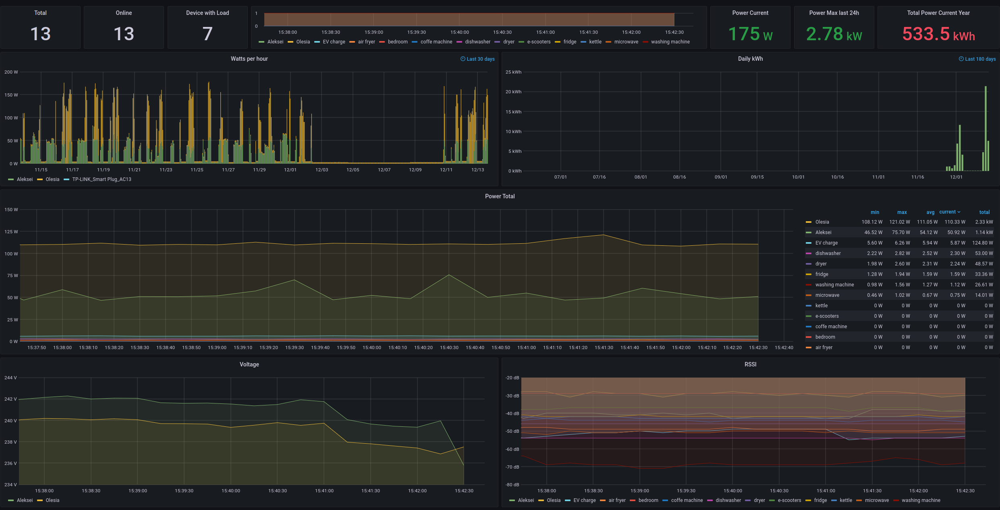

# Tapo P110 Prometheus Exporter

Exports energy consumption data from Tapo P110 smart devices to Prometheus, allowing monitoring and visualisation in Grafana.



## Exposed Metrics

```
# HELP tapo_p110_device_count Number of available TP-Link TAPO P110 Smart Sockets.
# TYPE tapo_p110_device_count gauge
tapo_p110_device_count 3.0
# HELP tapo_p110_today_runtime_mins Current running time for the TP-Link TAPO P110 Smart Socket today. (minutes)
# TYPE tapo_p110_today_runtime_mins gauge
tapo_p110_today_runtime_mins{alias="bedroom ",id="802227F94ADEDB42CF339D03BA89A7661F8C3517",ip_address="172.19.3.214",room="bedroom"} 0.0
tapo_p110_today_runtime_mins{alias="EV charge",id="80225115DDEC48F3B219A40EEEA55E7121A36348",ip_address="172.19.3.215",room="car-charger"} 885.0
tapo_p110_today_runtime_mins{alias="dryer",id="80227316FAA8F26E04A31C51DE724BCD21A23586",ip_address="172.19.3.212",room="dryer"} 885.0
# HELP tapo_p110_month_runtime_mins Current running time for the TP-Link TAPO P110 Smart Socket this month. (minutes)
# TYPE tapo_p110_month_runtime_mins gauge
tapo_p110_month_runtime_mins{alias="bedroom ",id="802227F94ADEDB42CF339D03BA89A7661F8C3517",ip_address="172.19.3.214",room="bedroom"} 9.0
tapo_p110_month_runtime_mins{alias="EV charge",id="80225115DDEC48F3B219A40EEEA55E7121A36348",ip_address="172.19.3.215",room="car-charger"} 4323.0
tapo_p110_month_runtime_mins{alias="dryer",id="80227316FAA8F26E04A31C51DE724BCD21A23586",ip_address="172.19.3.212",room="dryer"} 2080.0
# HELP tapo_p110_today_energy_wh Energy consumed by the TP-Link TAPO P110 Smart Socket today. (Watt-hours)
# TYPE tapo_p110_today_energy_wh gauge
tapo_p110_today_energy_wh{alias="bedroom ",id="802227F94ADEDB42CF339D03BA89A7661F8C3517",ip_address="172.19.3.214",room="bedroom"} 0.0
tapo_p110_today_energy_wh{alias="EV charge",id="80225115DDEC48F3B219A40EEEA55E7121A36348",ip_address="172.19.3.215",room="car-charger"} 105.0
tapo_p110_today_energy_wh{alias="dryer",id="80227316FAA8F26E04A31C51DE724BCD21A23586",ip_address="172.19.3.212",room="dryer"} 35.0
# HELP tapo_p110_month_energy_wh Energy consumed by the TP-Link TAPO P110 Smart Socket this month. (Watt-hours)
# TYPE tapo_p110_month_energy_wh gauge
tapo_p110_month_energy_wh{alias="bedroom ",id="802227F94ADEDB42CF339D03BA89A7661F8C3517",ip_address="172.19.3.214",room="bedroom"} 2.0
tapo_p110_month_energy_wh{alias="EV charge",id="80225115DDEC48F3B219A40EEEA55E7121A36348",ip_address="172.19.3.215",room="car-charger"} 38875.0
tapo_p110_month_energy_wh{alias="dryer",id="80227316FAA8F26E04A31C51DE724BCD21A23586",ip_address="172.19.3.212",room="dryer"} 3639.0
# HELP tapo_p110_power_consumption_w Current power consumption for TP-Link TAPO P110 Smart Socket. (Watts)
# TYPE tapo_p110_power_consumption_w gauge
tapo_p110_power_consumption_w{alias="bedroom ",id="802227F94ADEDB42CF339D03BA89A7661F8C3517",ip_address="172.19.3.214",room="bedroom"} 0.0
tapo_p110_power_consumption_w{alias="EV charge",id="80225115DDEC48F3B219A40EEEA55E7121A36348",ip_address="172.19.3.215",room="car-charger"} 5852.0
tapo_p110_power_consumption_w{alias="dryer",id="80227316FAA8F26E04A31C51DE724BCD21A23586",ip_address="172.19.3.212",room="dryer"} 2323.0
# HELP tapo_p110_rssi_db Wifi received signal strength indicator for the TP-Link TAPO P110 Smart Socket. (Decibels)
# TYPE tapo_p110_rssi_db gauge
tapo_p110_rssi_db{alias="bedroom ",id="802227F94ADEDB42CF339D03BA89A7661F8C3517",ip_address="172.19.3.214",room="bedroom"} -30.0
tapo_p110_rssi_db{alias="EV charge",id="80225115DDEC48F3B219A40EEEA55E7121A36348",ip_address="172.19.3.215",room="car-charger"} -52.0
tapo_p110_rssi_db{alias="dryer",id="80227316FAA8F26E04A31C51DE724BCD21A23586",ip_address="172.19.3.212",room="dryer"} -46.0
```

## Configuration

Communications are done directly with the P110 devices, therefore all IP addresses must be provided.

```
devices:
  study: "192.168.1.102"
  living_room: "192.168.1.183"
```

## Build docker

```
docker build -t tapo-exporter .
```

## Run docker

```
docker run --env-file tapo-exporter.env -v$(pwd)/tapo-exporter.yml:/etc/tapo-exporter.yml -p9877:9877/tcp tapo-exporter --exporter-port=9877
```

## Notes

This exporter has fix for PyP100 library
See:
https://github.com/fishbigger/TapoP100/issues/128
https://github.com/fishbigger/TapoP100/issues/123

Fixed PyP100:
https://github.com/almottier/TapoP100/tree/main/PyP100
